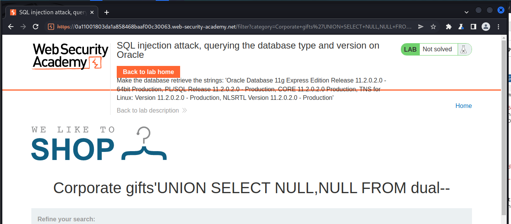
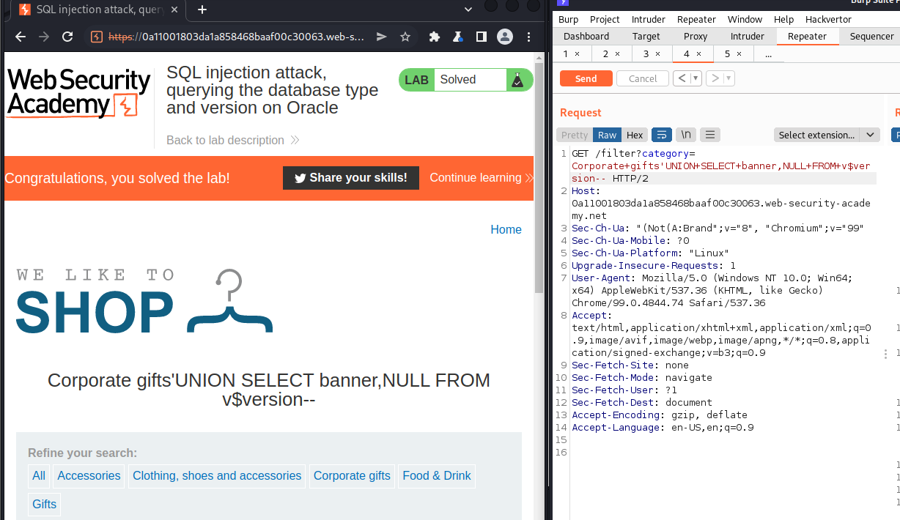

# Lab: SQL injection attack, querying the database type and version on Oracle

# 1. Vulnerable

This lab contains a SQL injection vulnerability in the product category filter. You can use a UNION attack to retrieve the results from an injected query.

To solve the lab, `display the database version string`

Hint: 
- On Oracle databases, every SELECT statement must specify a table to select FROM. If your UNION SELECT attack does not query from a table, you will still need to include the FROM keyword followed by a valid table name.

- There is a built-in table on Oracle called dual which you can use for this purpose. For example: UNION SELECT 'abc' FROM dual

- For more information, see our [SQL injection cheat sheet](https://portswigger.net/web-security/sql-injection/cheat-sheet).

Ok vậy ta có yêu cầu là làm hiện ra version Oracle mà trang web sử dụng bằng lỗi `SQLi`

# 2. Exploit

Từ SQLi cheat sheet ta có thể lấy được version theo các cách sau:

```
Oracle	SELECT banner FROM v$version
        SELECT version FROM v$instance
Microsoft	SELECT @@version
PostgreSQL	SELECT version()
MySQL	SELECT @@version
```

Ok nhưng khi muốn thực hiện `SELECT` thêm dữ liệu nào đó, ta sẽ cần dụng thêm câu lệnh truy vấn dữ liệu đó là `UNION`

VD:

```
SELECT column1, column2, ... FROM table_name1
UNION
SELECT column1, column2, ... FROM table_name2;
```

Điều cần lưu ý khi sử dụng `UNION` đó là số cột và kiểu dữ liệu cần phải giống nhau

Do đầu bài cần ta in ra chuỗi mà trong trang web cũng chỉ in ra từ database chuỗi nên việc cần làm bây giờ đó là tìm xem có bao nhiêu cột

Do ở đây sử dụng `Oracle` làm database nên ta phải trỏ đến 1 bảng bắt buộc, do không biết tên bất cứ 1 bảng nào nên ta sẽ sử dụng bảng `dual`

Trong `Oracle` có một bảng tích hợp sẵn gọi là `dual` mà ta có thể sử dụng cho mục đích này. Test và ta có số cột là 2

```
'UNION+SELECT+NULL,NULL+FROM+dual--
```



Từ [SQL injection cheat sheet](https://portswigger.net/web-security/sql-injection/cheat-sheet) trên ta có thể truy vấn version string Oracle bằng 2 câu lệnh 

```
SELECT banner FROM v$version
SELECT version FROM v$instance
```

Đã biết số cột, việc còn lại là làm theo cheat sheet thôi

```
'UNION+SELECT+banner,NULL+FROM+v$version
```




