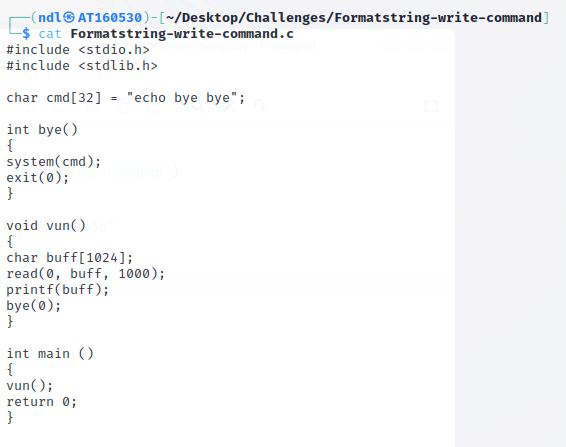
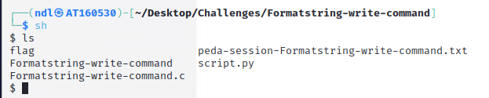
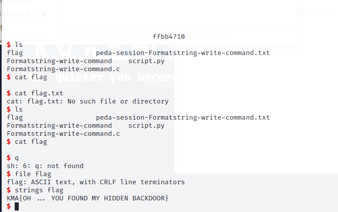

# BÀI TẬP LỚN KHAI THÁC LỖ HỔNG PHẦN MỀM

- Bài 3: Formatstring-write-command

Ở đây mình đã được cung cấp source code của bài này



Ở đây ta cần chú ý đến 2 hàm đó là hàm `vun()`

```
void vun()
{
char buff[1024];
read(0, buff, 1000);
printf(buff);
bye(0);
}
```

và hàm `bye()`

```
char cmd[32] = "echo bye bye";

int bye()
{
system(cmd);
exit(0);
}
```

Đầu tiên, ta cần cấp full quyền cho tất cả các file bằng câu lệnh 

```
chmod 777 *
```

Đầu tiên, biến `cmd` là biến toàn cục -> địa chỉ của biến `cmd` luôn không đổi

Kế đến, hàm `bye()` có chứa câu lệnh `system(cmd)`, hàm này sẽ thực thi câu lệnh lưu tại biến `cmd` trên hệ thống, ở đây giá trị `cmd` là `echo bye bye` chỉ đơn thuần là in ra `bye bye` trên màn hình


Do ở bài này đã không còn hàm `cat_flag()` nữa nên ý tưởng ở đây là thay thế `cmd` bằng 1 câu lệnh khác có thể in ra được flag, mình đã nghĩ ngay đến câu lệnh `sh`


```
Sau khi gõ lệnh sh trên terminal, bạn sẽ được chuyển đến một môi trường dòng lệnh mới, nơi bạn có thể gõ các lệnh shell và thực thi chúng. Nói ngắn gọn, sau khi chương trình chạy câu lệnh này, ta có thể trực tiếp tương tác với terminal
```

Vậy làm sao để sửa giá trị của `cmd`?

Cùng nhìn lại hàm `vun()` cho ta nhập vào biến `buff` rồi in ra biến `buff` bằng hàm `printf(buff)` nhưng ở đây mắc lỗi `format strings`

```
Lỗi format string (format string vulnerability) là một lỗi bảo mật trong việc sử dụng các chuỗi định dạng trong ngôn ngữ lập trình, như C và C++. Lỗi này xảy ra khi một ứng dụng không kiểm soát đủ việc xử lý các chuỗi định dạng người dùng nhập vào hoặc lấy từ bên ngoài, dẫn đến việc tấn công bằng cách truyền các chuỗi định dạng độc hại
```

Một số chuỗi định dạng như:

+ %<k>$n: Đếm số lượng các ký tự đã in ra màn hình trước đó bằng hàm `print()` rồi lưu giá trị đó dưới dạng 32 bit(4 bytes) vào địa chỉ hợp lệ tại vị trí thứ `x` trên stack

+ %<k>$hn: Đếm số lượng các ký tự đã in ra màn hình trước đó bằng hàm `print()` rồi lưu giá trị đó dưới dạng 16 bit(2 bytes) vào địa chỉ hợp lệ tại vị trí thứ `x` trên stack

+ %<k>$hhn: Đếm số lượng các ký tự đã in ra màn hình trước đó bằng hàm `print()` rồi lưu giá trị đó dưới dạng 8 bit(1 bytes) vào địa chỉ hợp lệ tại vị trí thứ `x` trên stack

+ %<k>x: In ra k ký tự ra màn hình

+ %<k>$p: In ra giá trị của stack thứ k dưới dạng hex

....

Ok vậy sau khi biết được lỗi ở đâu thì ta sẽ tiến hành khai thác:

Do chuỗi `sh` là `\x73\x68` được viết dưới dạng hex, nhưngở đa phần hệ điều hành sử dụng cấu trúc little-edian - và kali 64 bit cũng vậy -> chuỗi `sh` sẽ được lưu dưới dạng hex là `0x6873` = `26739`

-> Ta sẽ sử dụng `%<k>x: In ra k ký tự ra màn hình` và sử dụng `%<k>$n: Đếm số lượng các ký tự đã in ra màn hình và lưu vào địa chỉ hợp lệ tại trí thứ k trên stack`

Làm cách nào để trên stack xuất hiện địa chỉ cần ghi cũng như làm cách nào biết nó ở vị trí thứ bao nhiêu?

Đầu tiên ta sử dụng `%p` nhiều lần và trên màn hình sẽ in ra các giá trị của stack theo thứ tự


Ở đây ta sử dụng nhiều lần `%p` tương tự với `%1$p-%2$p-%3$p-%4$p-....`

Vậy là ta đã biết chuỗi ta nhập vào bắt đầu từ vị trí thứ 4 trên stack, việc còn lại là nhập vào địa chỉ chuỗi `cmd` khiến nó được lưu tại vị trí thứ 4 ấy

```
cmd = 0x804a040
payload = p32(cmd) + b"%26735x%4$n"
```

Do đây là cấu trúc 32 bit nên mỗi stack sẽ chỉ chứa 4 bytes nên ta sử dụng `p32()` là chuỗi hex dưới dạng `little-edian` để lưu vào stack thứ 4, in ra 26735 ký tự nữa (do 4 ký tự đầu là 4 ký tự của địa chỉ `cmd` rồi) => tổng lại ta được `26739 = 0x6873`


Sau khi chạy payload thì như đã thấy ta ta đã ghi đè chuỗi `sh` vào biến `cmd` rồi!!!

